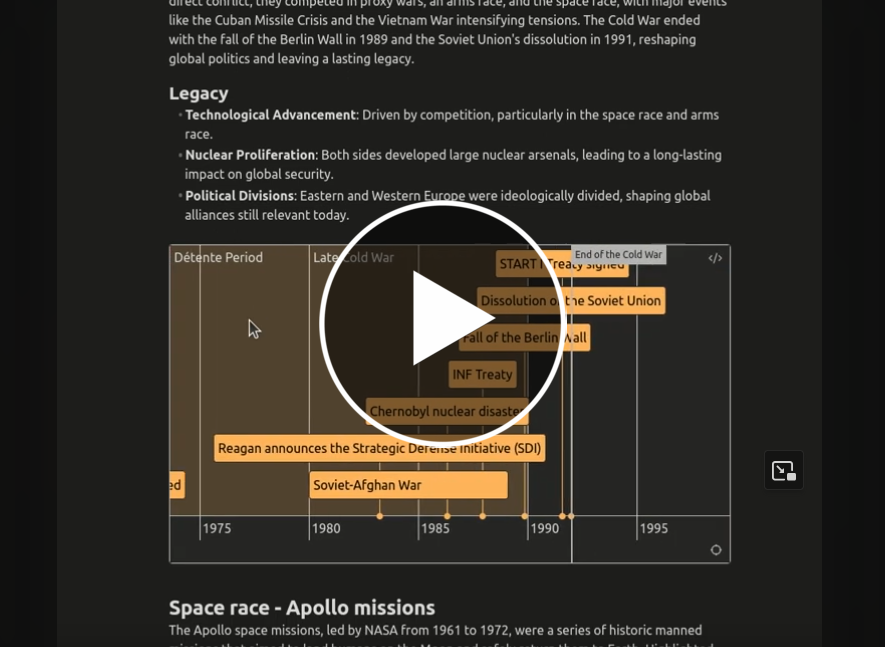
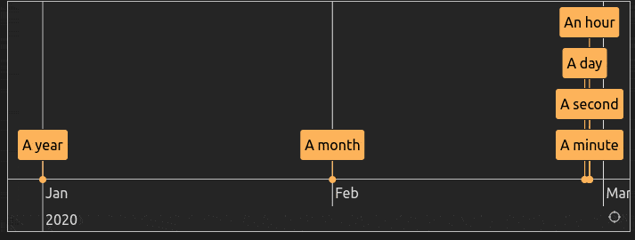
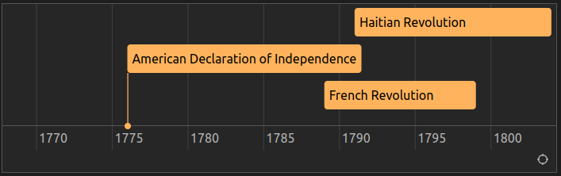
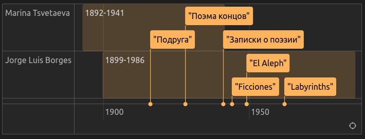
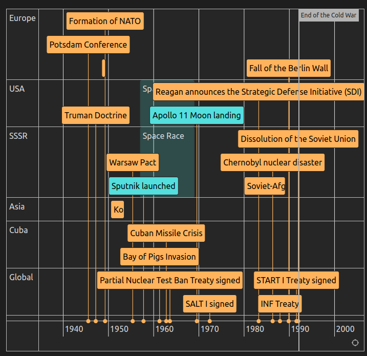
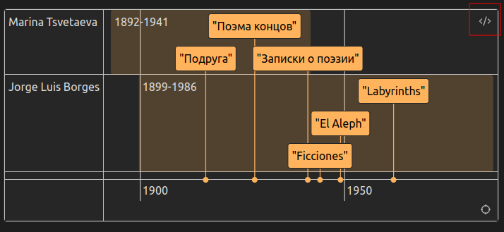
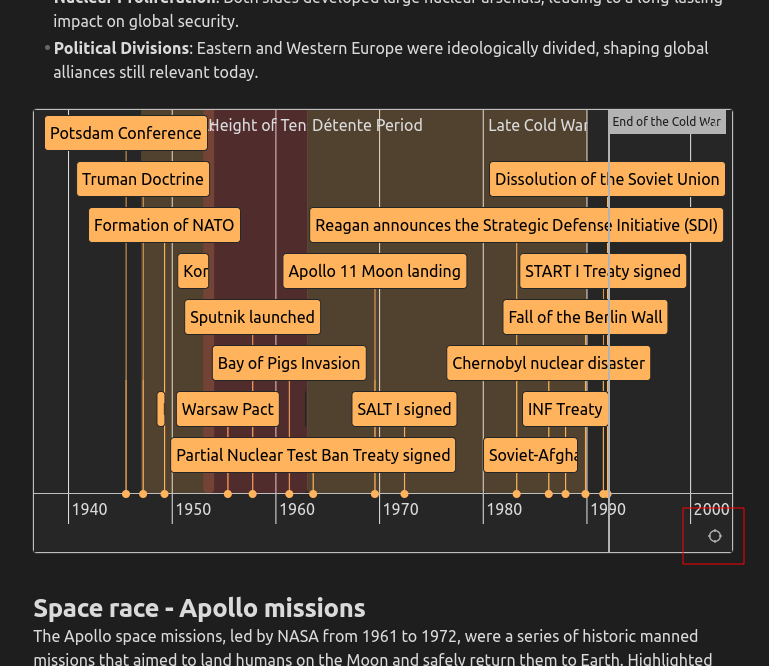
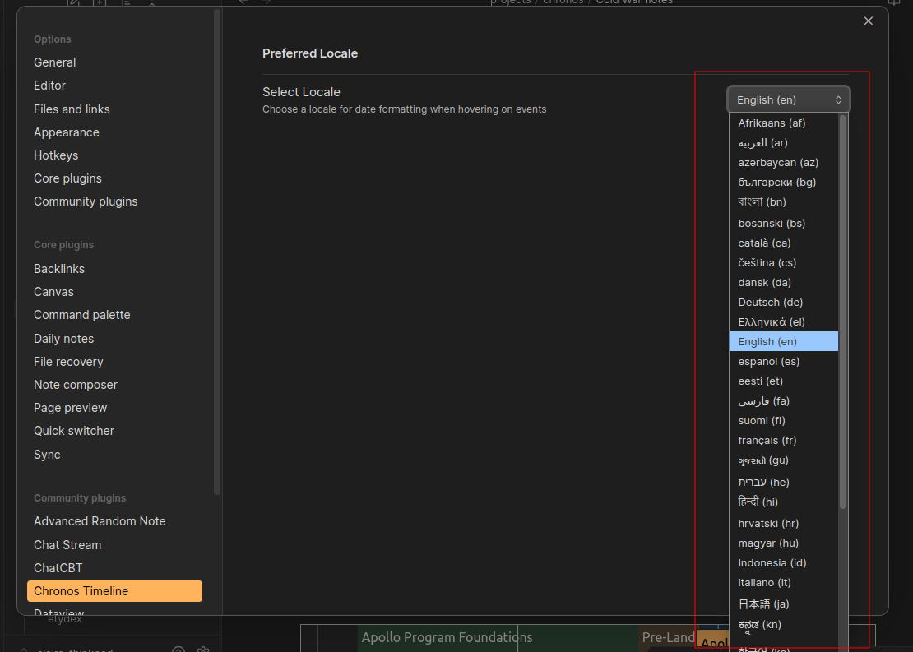

# Chronos Timeline - a plugin for Obsidian

Chronos is a custom markdown syntax used for visualizing interactive timelines inline in your Obsidian notes.

Timelines are styled to adapt to your Obsidian theme.

Powered by the [vis-timeline](https://www.npmjs.com/package/vis-timeline) library.

[](https://www.youtube.com/embed/iYaA-QrdMQk?si=WdO7GX657ZKPfTxZ)

## Basic usage

- [Chronos Timeline - a plugin for Obsidian](#chronos-timeline---a-plugin-for-obsidian)
  - [Basic usage](#basic-usage)
- [Syntax Overview](#syntax-overview)
  - [A note on dates](#a-note-on-dates)
  - [Comments (`#`)](#comments-)
- [Item types](#item-types)
  - [Events (`-`)](#events--)
    - [Single Date Event](#single-date-event)
    - [Events with start and end dates](#events-with-start-and-end-dates)
    - [Events with descriptions](#events-with-descriptions)
  - [Periods `@`](#periods-)
  - [Markers `=`](#markers-)
  - [Modifiers](#modifiers)
    - [Colors `#`](#colors-)
    - [Groups `{}`](#groups-)
  - [Advanced example](#advanced-example)
- [Actions](#actions)
  - [Edit](#edit)
  - [Refit](#refit)
- [Localization](#localization)

# Syntax Overview

Chronos parses markdown in `chronos` code blocks

````markdown
```chronos
<chronos timeline items here>
```
````

## A note on dates

Chronos can visualize dates from the year, month, date, hour, minute or second level, using syntax `YYYY-MM-DDThh:mm:ss`.

The only required part of a date is the year (`YYYY`).

Month and date default to `01` if not specified. Hour, minute and second default to `00` if not specified.

Examples

```
- [2020] A year
- [2020-02] A month
- [2020-02-28] A day
- [2020-02-28T12] An hour
- [2020-02-28T12:30] A minute
- [2020-02-28T12:30:09] A second
```



Date ranges are separated by a tilde `~`, and must be in chronological order

```
- [2020~2024]
- [2024-02-28~2024-05-11]
- [2024-02-28T05:30~2024-02-28T08:30]
```

You can signify BCE times with the negtive symbol (-)

```
- [-1000]  <--- 1000 BCE
- [-550~-20]  <--- 550 ~ 20 BCE
- [-550~550]  <--- 550 BCE ~ 550 CE
```

## Comments (`#`)

Chronos will ignore any line that starts with `#`. You can use this to write comments to yourself or block out items.

Example

````markdown
```chronos
# this line is a comment, it will be ignored by chronos

- [1789~1799] French Revolution
- [1791~1804] Haitian Revolution
- [1776] American Declaration of Independence

# the event below will not render, since it has been commented out
# - [1939~1945] World War II
```
````



# Item types

The first character of each line in your `chronos` block determines the item type. Certain items can be modified with colors and group membership (see [Modifiers](#modifiers))

## Events (`-`)

Events can include a single date or a date range. Event name and Description are optional.

### Single Date Event

````markdown
```chronos

- [Date] Event Name | Description

```
````

Example

### Events with start and end dates

A date range is represented with a tilde (`~`) between the start and end dates.

```

- [Date~Date] Event Name | Description

```

Example

### Events with descriptions

You can add additional information to an event by adding a pipe `|` after the Event name. This text will appear in a popup when you hover over an event.

## Periods `@`

Periods represent a span of time and are displayed with a semi-transparent background. They are represented using the @ symbol. **Periods must be a range with a start and end date**.

```
@ [Date~Date] Period Name

```

````markdown
```chronos

@ [-300~250] Yayoi Period
- [-100] Introduction of rice cultivation
- [-57] Japan’s first recorded contact with China

@ [250~538] Kofun Period
- [250] Construction of keyhole-shaped kofun burial mounds begins
- [369] Yamato state sends envoys to Korea

@ [710~794] Nara Period
- [712] Compilation of the Kojiki, Japan’s earliest chronicle
- [752] Great Buddha of Todai-ji is completed

```
````

Periods allow you to group related events and give them context by highlighting the time frame.

## Markers `=`

Markers are used to highlight a significant event that defines the start or end of a time period. Markers are typically placed on key dates and represent important milestones.

```
= [YYYY-MM-DD] Marker Name
```

    YYYY-MM-DD: The specific date of the marker.
    Marker Name: The title or description of the marker.

## Modifiers

Modifiers can be added to **Events** (`-`) and **Periods** (`@`) with the following optional syntax.

```
- [Date-Date] #color {Group Name} Event Name | description
```

The modifiers must go in this order: between Dates and Event Name, with color first if both color and group are used.

### Colors `#`

Available colors: `#red` | `#orange` | `#yellow` | `#green` | `#blue` | `purple` | `#pink` | `#cyan`

Example

````markdown
```chronos
- [1993~2001] #blue Clinton
- [2001~2009] #red Bush
- [2009~2017] #blue Obama
- [2017~2021] #red Trump
- [2021~2025] #blue Biden

- [2020-03-11~2023-05-11] #pink COVID19
```
````


### Groups `{}`

Events and Periods can be grouped into "swimlanes" by specifying a Group name in curly brakcets `{}` after the date (or color if present). Group names are case sensitive and may contain spaces. The order of items does not matter.

Example

````markdown
```chronos
@ [1892-10-08~1941-08-31]{Marina Tsvetaeva} 1892-1941
- [1916] {Marina Tsvetaeva} "Подруга"
- [1928] {Marina Tsvetaeva}  "Поэма концов"
- [1941] {Marina Tsvetaeva} "Записки о поэзии"

@[1899-08-24~1986-06-14]{Jorge Luis Borges} 1899-1986
- [1944] {Jorge Luis Borges} "Ficciones"
- [1949] {Jorge Luis Borges} "El Aleph"
- [1962] {Jorge Luis Borges} "Labyrinths"

```
````



## Advanced example

This example combines Events, Periods, Markers, Comments, Descriptions, Groups and colors

````markdown
```chronos
- [1945-07-17] {Europe} Potsdam Conference | where post-WWII Europe is divided
- [1947-03-12] {USA} Truman Doctrine | committing the U.S. to containing communism
- [1948-06-24~1949-05-12] {Europe} Berlin Blockade | and Airlift in response to Soviet actions in Berlin
- [1949-04-04] {Europe} Formation of NATO

# Early Cold War

@ [1957~1969] #cyan {SSSR} Space Race
@ [1957~1969] #cyan {USA} Space Race
- [1950-06-25~1953-07-27] {Asia} Korean War | between North and South Korea
- [1955-05-14] {SSSR} Warsaw Pact | in response to NATO
- [1957-10-04] #cyan {SSSR} Sputnik launched | initiating the Space Race
- [1961-04-17] {Cuba} Bay of Pigs Invasion | in Cuba

# Height of Tensions

- [1962-10-16] {Cuba} Cuban Missile Crisis | a peak confrontation between the U.S. and USSR
- [1963-08-05] {Global} Partial Nuclear Test Ban Treaty signed
- [1969-07-20] #cyan {USA} Apollo 11 Moon landing | U.S. wins the Space Race
- [1972-05-26] {Global} SALT I signed | first Strategic Arms Limitation Treaty

# Détente Period

- [1979-12-24~1989-02-15] {SSSR} Soviet-Afghan War | straining Soviet resources
- [1983-03-23] {USA} Reagan announces the Strategic Defense Initiative (SDI)
- [1986-04-26] {SSSR} Chernobyl nuclear disaster
- [1987-12-08] {Global} INF Treaty | signed, eliminating intermediate-range nuclear missiles

# Late Cold War

- [1989-11-09] {Europe} Fall of the Berlin Wall | symbolizing the end of Cold War tensions
- [1991-07-31] {Global} START I Treaty signed | further arms reduction
- [1991-12-26] {SSSR} Dissolution of the Soviet Union | officially ending the Cold War

= [1991-12-26] End of the Cold War

```
````



# Actions

## Edit

To switch to edit mode for markdown, hover on the timeline then click the code icon that shows up in the upper right corner



## Refit

Click the refit button (crosshairs icon) in the lower right to refit all items to the view window.



# Localization

In the Chronos Timeline plugin settings, you can select your preferred language for displaying dates in event tooltips. Available language options depend on your system's language settings.


